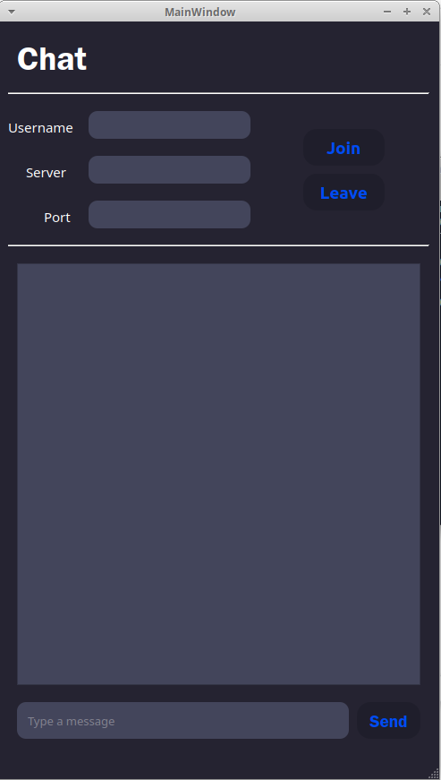
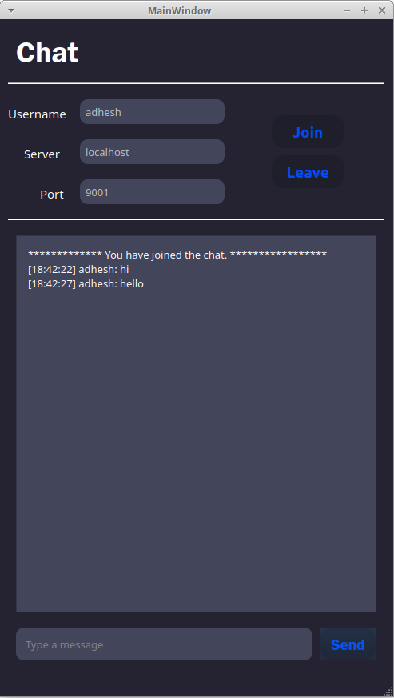

# BaBbLe
A simple chat room application built using socket programming concepts and TCP protocol. The client side UI is made using PyQt5.

### Requirements
* Python 3
* PyQt 5

### Run the Code

##### Host the Server
The server can be hosted by running the ```server.py``` file present in the chat folder.
```bash
$ python3 server.py
```
The server code has the constant parameters of:
* ```SERVER``` : defines the server address where the server is hosted
* ```PORT```: defines the port number of the host server

By changing these, we can set the server connection details. To make the server publicly accessible we can use tunelling services like **ngrok**. The server and port details we get from ngrok can be used to access the locally run server program even from different networks by entering them as the client server-port details.

##### Run the Client
The client can be executed by running the ```ui_client.py``` file present in the chat folder.
```bash
$ python3 ui_client.py
```
The application window should be fired up and visible. In the application, fill in the deatils of the **username**, **server address** and **port number** for the connection. Click on **Join** button to establish connection with the server. You will be prompted of successful connection in the TextArea in the application. Once connected to the server, you can begin chatting with existing users of the chat room by entering your message in the text field given and clicking on **Send**.
If you want to leave the chatroom, click on **Leave** button, it will gracefully shutdown connection and close the application.

### A Look at the UI

     


### Demo
* Client-1: https://drive.google.com/file/d/15BGSdUbcui3-1-QFpKMnzIBowN-jNJc3/view?usp=sharing
* Client-2: https://drive.google.com/file/d/1G_XyIS_0-viW3t4WIXyFmEWxqgPK34my/view?usp=sharing
* Server: https://drive.google.com/file/d/1emJXra-Exv1Qwxd0uhmyU0ND9SqpdBc5/view?usp=sharing
